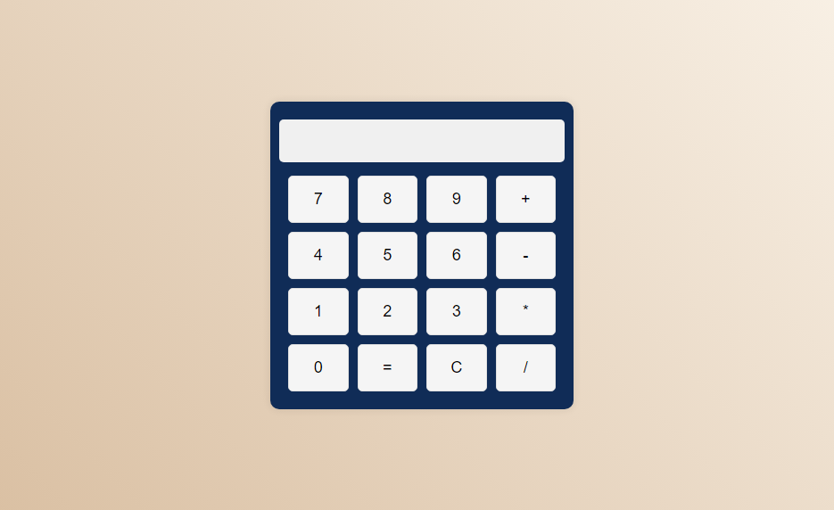

# Calculadora Simples // Very Simple Calculator

A simple web calculator built using HTML, CSS and JavaScript. This calculator allows users to perform basic operations of addition, subtraction, multiplication and division.

Uma calculadora web simples construída usando HTML, CSS e JavaScript. Esta calculadora permite que os usuários realizem operações básicas de adição, subtração, multiplicação e divisão.

## Funcionalidades // Functionalities

- Perform addition, subtraction, multiplication and division operations. // Realizar operações de adição, subtração, multiplicação e divisão.
- Intuitive and friendly user interface. // Interface de usuário intuitiva e amigável.
- Real-time response as numbers and operators are entered. // Resposta em tempo real enquanto os números e operadores são inseridos.

##Processo de Criação // Creation Process##

I used HTML, CSS and JavaScript, as I'm in the process of learning it's a simple project
   but I'm already starting to use my knowledge in programming.
   

  Utilizei HTML, CSS e JavaScript, como estou em processo de aprendizado é um projeto simples
  más que já estou começando a utilizar meus conhecimentos em programação.

  
                           Feito por Thales - Made by Thales
